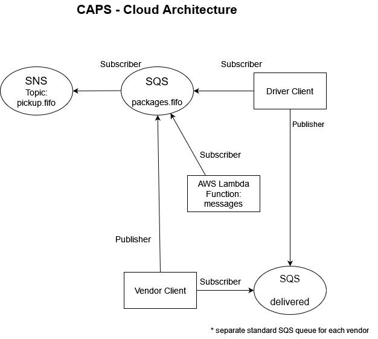
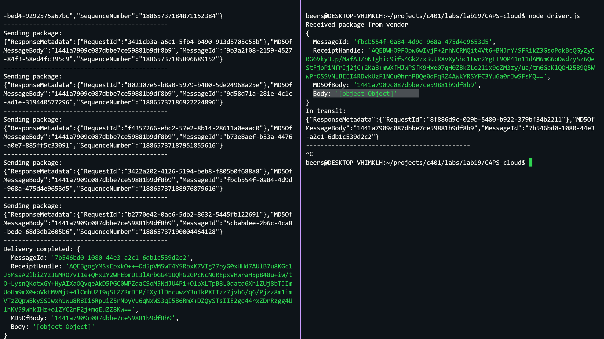

# CAPS-cloud

(in progress)

This application was created for the purpose of creating a cloud version of the [CAPS](https://github.com/Beers15/CAPS) system

### AWS Service components:

  * One SNS with topic 'pickup': this receives all pickup requests from vendors
  * One SQS Queue (FIFO): 'packages', this contains all delivery requests from vendors, in order of receipt.
  * 1+ SQS Queues (Standard): One can be added for each vendor and contains all delivery notifications from the drivers to that vendor
  * 1 AWS Lambda used for logging the 'packages' SQS Queue events

## UML diagram

### Console output

